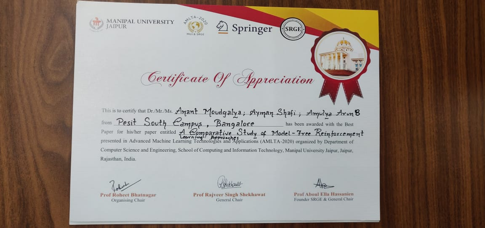

Hello! This post describes my experience presenting my paper (and winning the Best Paper Award :D) at AMLTA - 2020 (Feb 13-15).

## Paper Details

I am the lead author of my first [paper](../files/RL_Paper.pdf), "A Comparative Study of Model Free Reinforcement Learning Approaches". The following is the abstract for a cursory understanding :

This study explores and compares 3 model-free learning methods, namely, Deep Q-Networks(DQN), Dueling Deep Q-Networks(DDQN) and State - Action - Reward - State - Action (SARSA) while detailing the mathematical principles behind each method. These methods were chosen as to bring out the contrast between off-policy(DQN) and on-policy(SARSA) learners. The DDQN method was included as it is a modification of DQN. The results of these methods and their performance on the classic problem, CartPole were compared. Post training, testing results for each of the models were as follows: DQN obtained an average per episode reward of 496.36; its variant and improvement,
DDQN obtained a perfect score of 500 and SARSA obtained a score of 438.28. To conclude, the theoretical inferences were decisively reaffirmed with observations based on descriptive plots of training and testing results.

I wrote this paper in my junior year, and you can find the source code and related work [here](https://github.com/anantmoudgalya/GamePlaying-RL).

## Talks at the conference

I had the pleasure of attending 3 great keynote speeches at the conference.  

### Talk 1
I particularly remember [Dr. Shalabh Bhatnagar](https://www.csa.iisc.ac.in/~shalabh/index.html)'s talk delivering an introduction to Stochastic Approximation in Machine Learning. 
It was a fast paced, yet detailed introduction into the topic. Although I couldn't keep up with most of the mathematics, I was sure to note down things of interest and things I wanted to read more.
I got an understanding of the Robbins-Monro Algorithm, which after further reading, sparked my interest. He also cited a great publication for understanding stochastic approximation, the book on Parameter Optimization by VS Burkar.  
He also detailed his experimental results after multiple simulations of using Q Learning with Stochastic Approximation for Intelligent Traffic Control which were incredibly impressive, and had proved their effectiveness after implementing it at a nearby Traffic Signal.

### Talk 2
The second talk that I really enjoyed was delivered by Mr. [Shubham Gupta](https://www.linkedin.com/in/iammastermac/) of Dell Technologies. As ML is my domain of interest, his talk titled "Industrial Challenges and Use Cases related to ML" was a must-attend.  
He listed a few commmon enterprise use cases, as follows: 
* Conversational AI
* Sales Predictions
* Product Recommendations
* Intelligent Automation
* Predictive Maintenance
* Anomaly Detection

Beyond this, he listed 3 use cases Dell had solved, as follows:
* Autonomous Intelligent System for Data Backed Feature Enhancement.
    - He detailed that Dell had designed a system to priorities which features to enhance given performance data of a specific product/service.
    - If the product has 100 features, and we have to learn which 10 features to prioritize for improvement, the designed system would figure it out by leveraging feature importance and performance data.
* Novel Method to reliably access real time data in poor connectivity for mobile apps.
    - He talked about a novel method they had designed to solve this issue and that it was Patented by Dell.
* Autonomous Customised Product Creation and Recommendation system, personalised for customers
    - He described a system that Dell had designed that would recommend customers customised products, based on their shopping or browsing history.
    - If a customer is clicking more into computers with higher RAM and higher SSD space, the system suggests a customised product created for the customer with those features which may cost lesser.

## Winning Best Paper!

We presented our paper on the second day of the event, and it was recieved well by the judges. We were questioned about some of the technical details, i.e, 
* how are you ensuring that the test scores are indicative of the model's performance?
    - We had tested the trained model on 150 fresh episodes of gameplay, and so the policy developed so far was tested fairly and correctly on the test episodes.
* Why is decay factor set to 0.99?
    - The decay factor was set that high as we want the agent to explore the environment, 99% of the time in the beginning phases, we slowly reduce the decay factor until it reaches the minimum threshold of 0.01. At that point, the agent will more often exploit it's previous experiences and explore the environment only 1% of time.
* What are the applications of these models?
    - We mentioned that we had explored further applications of these models, the papers we had referenced had applications of Q Learning in Stock Trading systems as well as Chemical Reaction systems.

At the end of the session, after all the presentations, we were awarded the Best Paper Award!

As a sports fan, I intend to explore the applications of Reinforcement Learning in Sports, so stay tuned for updates on that!